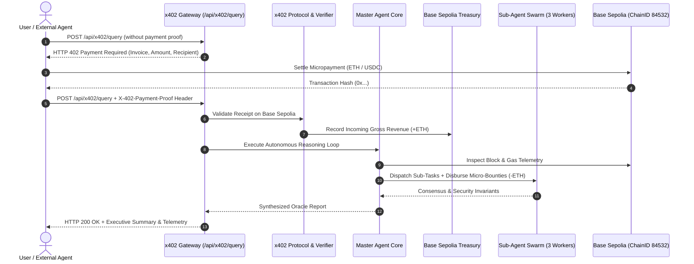

# 🌐 NEXUS-402 // Autonomous AI Data Oracle & x402 Micropayment Broker

> **Built for [Rise In: Agentmaxxing](https://www.risein.com) (Build. Experiment. Ship.)**  
> *Target Ecosystem: Base Sepolia Testnet (ChainID: 84532) | Standard: HTTP 402 Micropayments*

---

## ⚡ Overview

**NEXUS-402** is a production-grade autonomous AI Oracle & Data Broker designed for the agentic economy. It implements the **x402 (HTTP 402 Payment Required)** standard, allowing users and other autonomous AI agents to discover intelligence endpoints, negotiate payment challenges, and settle micropayments on **Base Sepolia**.

Once payment is cryptographically verified on-chain, NEXUS-402 launches an autonomous reasoning pipeline: querying Base Sepolia smart contract state, synthesizing multi-source market intelligence, evaluating bytecode vulnerabilities, and delegating specialized tasks to worker sub-agents with autonomous on-chain bounty payouts.

---

## 🏆 Alignment with Rise In Agentmaxxing Judging Criteria

| Criterion | Weight | How NEXUS-402 Delivers |
|---|---|---|
| **1. The Build** | **30%** | Fully operational Next.js + TypeScript agent core with real-time thought telemetry, structured findings, confidence scores, and reactive web dashboard. |
| **2. Experimentation** | **25%** | Deep tool orchestration: Base Sepolia On-Chain Inspector, Web Intelligence Feed, Smart Contract Bytecode Auditor, and Sub-Agent Swarm Delegator. |
| **3. Crypto Integration** | **25%** | Native Base Sepolia testnet integration, real HTTP 402 handshake headers, autonomous treasury accountant, and sub-agent bounty disbursals. |
| **4. Idea & Creativity** | **10%** | True Agent-to-Agent (A2A) economic primitive — enabling AI agents to buy and sell verified data directly over HTTP without human intervention. |
| **5. Execution & Polish** | **10%** | Cyber-glass futuristic UI, interactive 402 payment simulator, live Basescan links, memory inspection, and copyable SDK snippets. |

---

## 🏗️ System Architecture



---

## 🚀 Quick Start

### 1. Prerequisites
- Node.js `v18+` (Tested on Node `v20+` / `v26+`)
- npm `v9+`

### 2. Install Dependencies
```bash
npm install
```

### 3. Run Development Server
```bash
npm run dev
```
Open [http://localhost:3000](http://localhost:3000) in your browser.

---

## 📡 Agent-to-Agent (A2A) API Usage

### 1. Step 1: Probe the Endpoint (Trigger 402 Challenge)
```bash
curl -i -X POST http://localhost:3000/api/x402/query \
  -H "Content-Type: application/json" \
  -d '{"query": "Audit Base Sepolia Vault invariants", "tier": "deep"}'
```
**Response (`HTTP/1.1 402 Payment Required`):**
```http
X-402-Payment-Required: true
X-402-Invoice-ID: inv_1791392974547_xx6yw8w
X-402-Recipient: 0x84532B07eCe33dA2708bDa90a36e9B137Ec7402F
X-402-Chain-Id: 84532
X-402-Amount-Eth: 0.0008
```

### 2. Step 2: Pay on Base Sepolia & Fulfill Query
```bash
curl -X POST http://localhost:3000/api/x402/query \
  -H "Content-Type: application/json" \
  -H "X-402-Payment-Proof: txHash=0x9a8f...; payerAddress=0x7099...; invoiceId=inv_1791392974547_xx6yw8w" \
  -d '{"query": "Audit Base Sepolia Vault invariants", "tier": "deep"}'
```

---

## 🛠️ Service Tiers

| Tier | Price | Tools Enabled | Scope |
|---|---|---|---|
| **Quick Snapshot** | `0.0003 ETH` | BaseSepoliaInspector, FastWebOracle | Real-time Base Sepolia gas, blocks & quick synthesis |
| **Deep Protocol Intel** | `0.0008 ETH` | + ContractBytecodeAuditor, CodeSandbox | In-depth security scan, sentiment velocity, risk scoring |
| **Multi-Agent Matrix** | `0.0015 ETH` | + SubAgentDelegator, TreasuryDisburser | 3 Autonomous Sub-Agents (Security, Quant, Trend) + Bounties |

---

## 📜 License
MIT License — Created for Rise In: Agentmaxxing.
